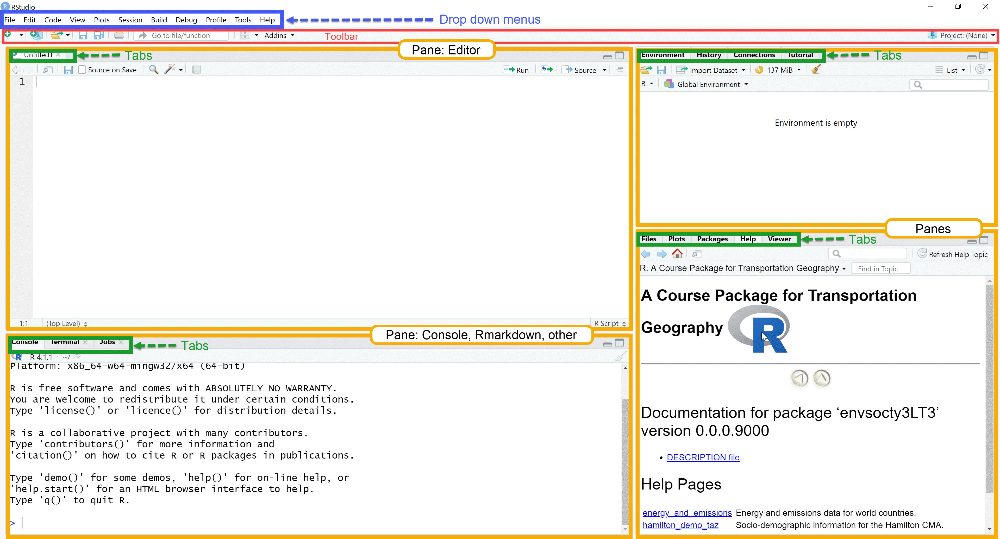
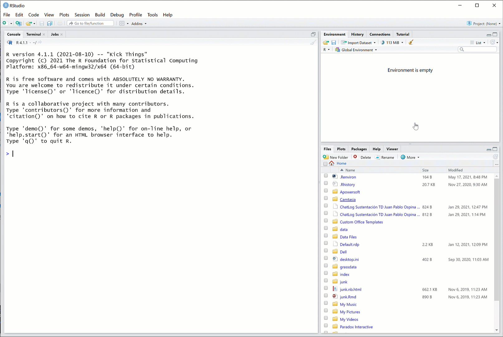
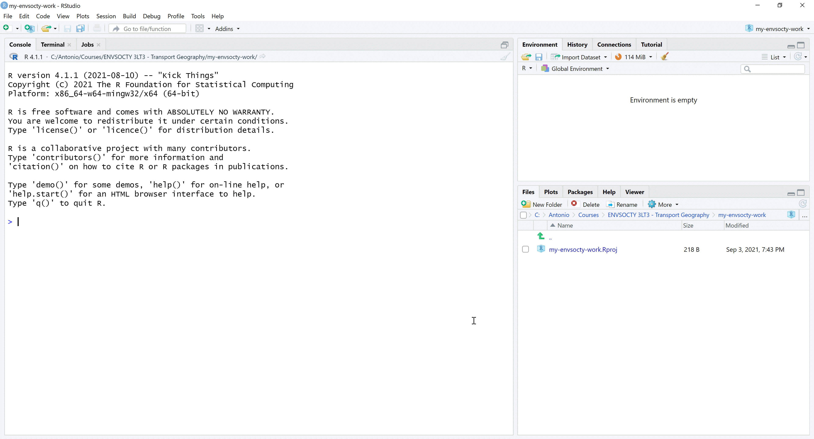
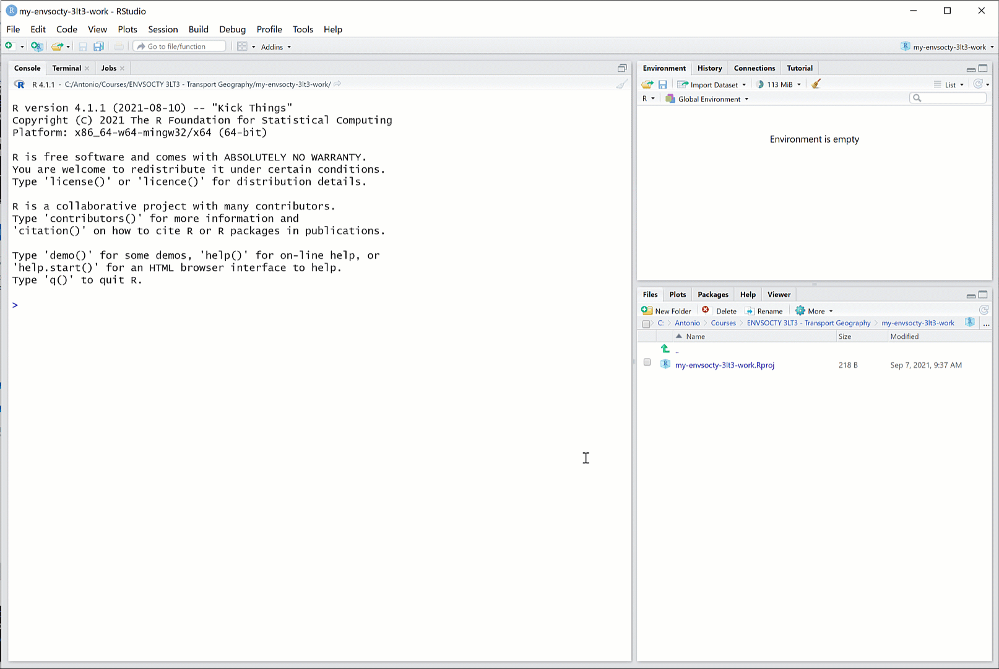
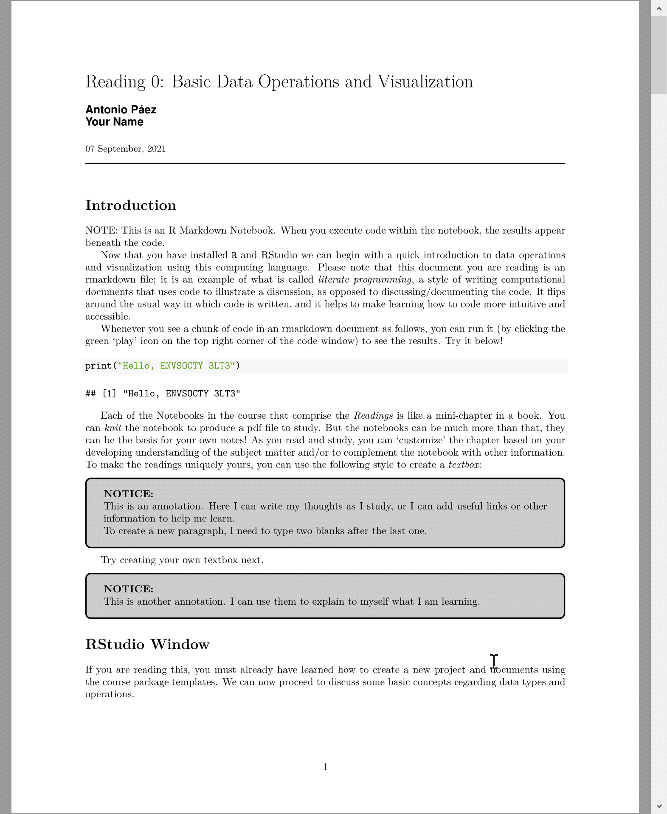
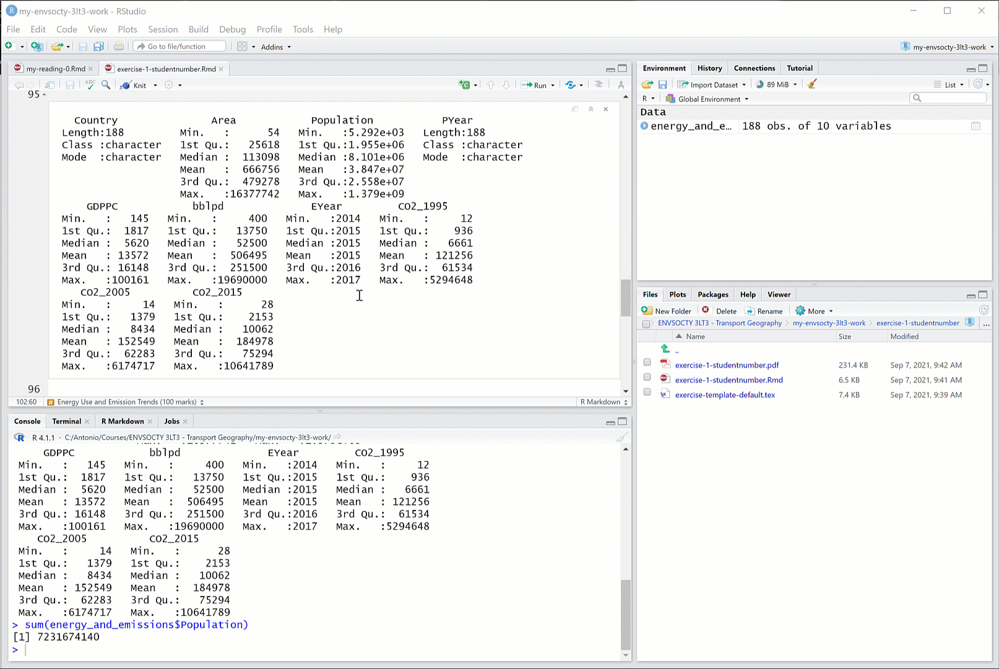

<!-- README.md is generated from README.Rmd. Please edit that file -->

# edashop <a href="https://paezha.github.io/edashop/"></a>

<!-- badges: start -->

[](https://lifecycle.r-lib.org/articles/stages.html#experimental)
[](https://CRAN.R-project.org/package=envsocty3LT3)
<!-- badges: end -->

Package {edashop} is an open educational resource to teach a workshop on
exploratory data analysis (EDA).

The package aims to combine various advantages of working with the [`R`
statistical computing project](https://www.r-project.org/):

-   Ease of distribution
-   Reproducibility
-   Availability of templates for computational notebooks
-   Rigor in documentation of data sets and computational products

The package is designed for use in a 5-session workshop (approximately
10 hours) that teaches the principles of exploratory data analysis using
`R`. The package includes the following components:

-   Document templates with *Sessions*.
-   Data sets used in the Sessions

The *Sessions* are [R markdown](https://rmarkdown.rstudio.com/)
documents with the main contents of the workshop. These documents
resemble course notes, but with a difference: they are [literate
programming](https://en.wikipedia.org/wiki/Literate_programming)
documents that are are interactive and editable, which means that you
can work with them in ways not possible with conventional printed notes.

## Seminar outline

### Session 1: Basics of working with `R` (2 h)

-   Why `R`?
-   Installing the software: `R` and R Studio
-   Packages
-   Installing packages: CRAN and other sources
-   Getting help
-   (Break)
-   Creating a project
-   Directory structure
-   Creating new files: types of files
-   Literate programming

### Session 2. Data (2 h)

-   Why measuring things?
-   Scales of measurement
-   Data classes
-   Data structures: vectors, matrices, lists, data frames
-   (Break)
-   Data manipulation
-   {dplyr}: a grammar of data manipulation

### Session 3. Exploratory data analysis I: Descriptive statistics (2 h)

-   What is EDA?
-   Properties of data: central tendency and dispersion
-   Quick data summaries
-   Appropriate summary statistics by scale of measurement
-   (Break)
-   Univariate description
-   Bivariate description
-   Multivariate description

### Session 4. Exploratory data analysis II: Visualization techniques (2 h)

-   Why visualization?
-   {ggplot2}: a grammar of plots
-   Creating empty plots
-   Mapping data to aesthetics
-   (Break)
-   Geometric objects
-   Univariate description
-   Bivariate description
-   Multivariate description

### Session 5. A date with EDA: Bring your own data (2 h)

-   Reading external data
-   Hands-on practice

## What do I need to use this package?

The workshop does not assume knowledge of, or experience working with
`R`. So, no previous knowledge regarding the software/language is
required, besides experience using computers in general, and maybe a
word processor (e.g., Microsoft Word) and spreadsheets (e.g., Microsoft
Excel). To use the package you will begin from the very basics: how to
install and use the necessary software: `R` and an Interactive
Development Environment (e.g., RStudio) as explained next.

### `R`: The open statistical computing project

What is `R`?

`R` is an open-source language for statistical computing. It was created
in the early 1990s by [Ross
Ihaka](https://en.wikipedia.org/wiki/Ross_Ihaka) and [Robert
Gentleman](https://en.wikipedia.org/wiki/Robert_Gentleman_(statistician))
at the University of Auckland, New Zealand, as a way to provide their
students with an accessible, no-cost statistical application for their
courses. `R` is now maintained by the `R` Development Core Team, and it
continues to be developed by hundreds of contributors around the globe.
`R` is an attractive alternative to other software packages for data
analysis (e.g., Microsoft Excel, Matlab, Stata, ArcGIS) due to its
open-source character (i.e., it is free), its flexibility, and large
user community. The size of the `R` community means that if there is
something you want to do (for instance, estimate a linear regression
model or plot geographical information), it is very likely that someone
has already developed a package for it in `R`.

A good way to think about `R` is as a core package, with a library of
optional packages that can be attached to increase its core
functionality. `R` can be downloaded for free at:

<https://cran.rstudio.com/>

`R` comes with a built-in console (a graphical user interface), but
better alternatives to the basic interface include Interactive
Development Environments like RStudio, which can also be downloaded for
free:

<https://www.rstudio.com/products/rstudio/download/>

`R` requires you to work using the command line, which is going to be
unfamiliar to many of you accustomed to user-friendly graphical
interfaces. Do not fear. People worked for a long time using the command
line, or using even more cumbersome systems, such as punched cards in
early computers. Graphical user interfaces are convenient, but they have
a major drawback, namely their inflexibility. A program that functions
based on graphical user interfaces allows you to do only what is
hard-coded in the user interface. Command line, as you will soon
discover, is somewhat more involved, but provides much more flexibility
in operation, and the ability to be more creative.

To begin, install `R` and RStudio in your computer. This
[video](https://www.youtube.com/watch?v=gZh91IdIMts) (5:23 min) shows
how to install these applications.

If you have used `R` and have a previous instal, update it to `R`
version 4.2.0 (2022-04-22) – “Vigorous Calisthenics”. **The package was
developed using “Vigorous Calisthenics”!**

### RStudio window: A Quick Tour

RStudio is an *Interactive Development Environment* (IDE for short). It
takes the form of a familiar window application, and it provides a
complete interface to interact with the language `R`. The application
consists of a window with toolbars and several panes. Some panes include
several tabs. There are the usual drop-down menus for common operations.
See Figure 1 below.


**Figure 1.** *RStudio IDE*

The editor pane allows you to open and work with text and other files.
In these files you can write instructions that can be passed on to `R`
for execution. Writing something in the editor does not execute the
instructions, it merely records them for possible future use.

The console pane is where instructions are passed on to the program.
When an instruction is typed (or copied and pasted) there, `R` will
understand that it needs to do something. The instructions must be
written in a way that `R` understands, otherwise errors will occur.

The top-right pane includes a tab for the environment; this is where all
data objects that are currently in memory are reported. The History tab
in the same pane acts like a log: it keeps track of all instructions
that have been executed in the console. Depending on your project, you
may see other tabs there.

The last pane in the bottom-right includes a few other useful tabs. The
File tab allows you to navigate directories in your computer, change the
working directory, see what files are where, and so on. The Plot tab is
where plots are rendered, when instructions require `R` to do so. The
Packages tab allows you to manage packages, which as mentioned above,
are pieces of code that can augment the functionality of `R`. The Help
tab is where you can consult the documentation for
functions/packages/see examples, and so on. The Viewer tab is for
displaying web content locally. Many `R` functions create html output
and it is in this pane where this kind of content can be previewed.

## Quick Start Guide

Once you have installed `R` and RStudio you are ready to install the
course package {edashop}. The package is available from
[GitHub](https://github.com/paezha/envsocty3LT3), and to install it you
need to run the following code in your `R` console:

``` r
install.packages("remotes")
remotes::install_github("paezha/edashop")
```

This will download the package to your personal library of packages and
install it to make the package available for use locally. Behind the
scenes, {envsocty3LT3} uses LaTeX to convert documents to PDF. For this
you need to have install LaTeX in your system. The simplest approach on
any platform is with `R` package [tinytex](https://yihui.name/tinytex/),
as follows:

``` r
install.packages(c('tinytex', 'rmarkdown'))
tinytex::install_tinytex()
```

After restarting R Studio, confirm that you have LaTeX with the
following command:

``` r
tinytex:::is_tinytex() 
```

## Recommended Workflow

After installing the package, this is the recommended workflow for using
it in the workshop.

### Create a project for all your work in this workshop

Follow the steps below to create a new project. A project is the best
way to keep your work in this course nicely organized.

You can create a new project using the buttons in the toolbar. Figure 2
shows one way of doing this:
 **Figure
2.** *Create new project - option 1*

Figure 3 shows an alternative way of doing the same, using the button
for managing projects in the R Studio interface:
 **Figure
3.** *Create new project - option 2*

You then need to select a new directory to store your new project. Give
the new directory a name, and save it in a place that you can easily
find (for instance, the folder where you keep your academic work).
Figure 4 illustrates the steps to do this:

**Figure 4.** *Choose to store the project in a new directory*

After you click ‘Create Project’, you will have an `R` session with your
new project. This will look like the image in Figure 5.
 **Figure 5.**
*Your project keeps all your files nicely organized*

### Working with your preliminary reading in the course package

You need to restart R Studio once after installing the package before
you can access the readings and exercises.

After doing so, you will find that all your readings are included in the
course package. Each reading is like a mini-chapter in a book (instead
of asking you to buy a book, we will give you the contents). But
readings can be much more than that. To begin working with your
preliminary reading, you begin by creating a new file and choosing R
Markdown from a template. Select template `Reading-0` from the course
package and give it a name. After you click ‘OK’, a new R Markdown file
will open in your editor. Also, notice that a new folder appears in your
project to keep this file. The process is illustrated in Figure 6.
 **Figure
6.** *Creating a new file from a template*

Your new file is an R Markdown document. This is a text file with
*chunks* of code that can be executed. `EDA-0` will introduce you to the
use of R Markdown. The document is editable, which means that you can
annotate it. To begin with, you can add your name to the list of authors
of the document. You can execute code by clicking on the ‘play’ icon on
the top-right corner of a chunk of code. The template also includes a
definition for a *textbox*. You can introduce a textbox in the text
using this format:

    :::{.textbox data-latex=""}
    This is my annotation.
    :::

Figure 7 illustrates these steps.

**Figure 7.** *Working with your reading*

Once you are happy with your work using this file, you can create a pdf
file to study by *knitting* the document. Knitting will convert the R
Markdown to a pdf file. Click the Knit button in the top left corner to
do this. You can knit your document at any time, and as many times as
you want; remember, you can always start afresh by creating a new R
Markdown file with the same template. See Figure 8 for an example of
knitting. 
**Figure 8.** *Click ‘Knit’ on the toolbar to convert your R Markdown
into a pdf file*

Figure 9 shows the result of knitting your R Markdown file.
 **Figure
9.** *The result of knitting is a pdf file with your reading*

Since you can edit and annotate the text, you can essentially
*customize* the chapter so that it is a unique reflection of your
learning. As you progress with the course and complete all the readings,
you will have a collection of *unique* chapters that track your very
personal learning experience in this course.

### Working on your first exercise

Working on your exercises (which you will submit for grading) is very
similar to working with your readings. First, you need to create a new R
Markdown file from a template. For the first exercise, you would select
the template for `Exercise-1`. Figure 10 illustrates the steps. Use the
following naming convention for your exercise files:
`exercise-number-studentnumber`. Once you click ‘OK’ a new R Markdown
file will appear in your editor, as well as a new folder where this file
resides.

**Figure 10.** *Creating a new file to work on an exercise*

To begin, you can edit the header of the document with your personal
information, like name and student number (see Figure 11).

**Figure 11.** *Entering your personal information in the header of the
R Markdown document*

You can also run chunks of code (see Figure 12).

**Figure 12.** *Running chunks of code in your exercise*

And importantly, to work on your exercise, you can enter your answers as
text and create new chunks of code to do any calculations you need for
your answers, as shown in Figure 13.

**Figure 13.** *Working to answer the questions in your exercise*

After you complete your exercise, you will need to return to the header
and complete two sections: `highlights` and `threshold_concepts`. The
highlights ask you to reflect on your learning experience working on the
exercise. Try to write concisely in approximately 200 words. The
threshold concepts are key ideas that once you grasp them they change
your understanding of a topic, phenomenon, subject, method, etc. Write
between three and five threshold concepts that apply to your learning
experience working on this exercise. Figure 14 illustrates this step.

**Figure 14.** *Writing the highlights of the exercise*

The highlights and threshold concepts are the last element of your
exercise, and after writing them you can knit the document to generate
the pdf file for submission. Click the Knit button in the top left
corner to knit (see Figure 15).

**Figure 15.** *Knitting the exercise*

You are now ready to submit the exercise following the instructions in
the course outline.
